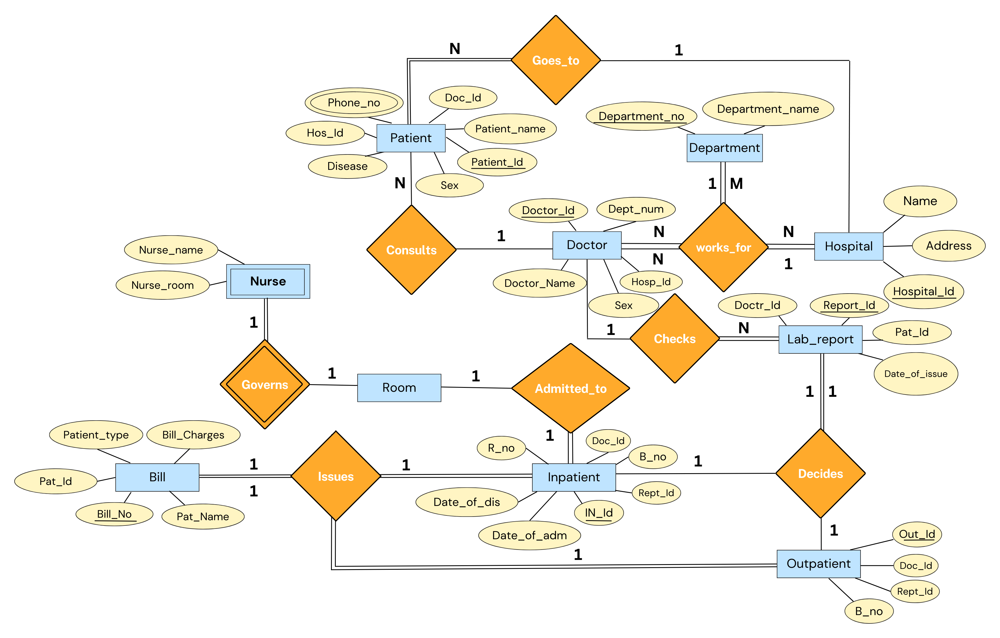
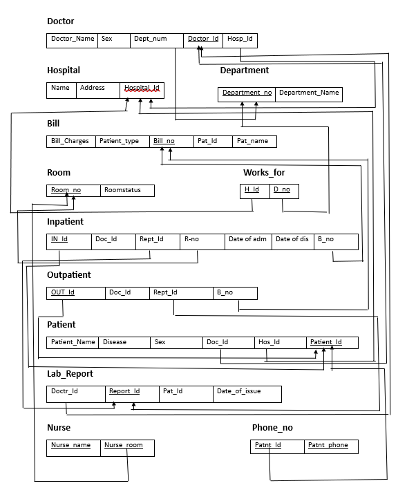

# <p align="center">Hospital Management System</p>

### <p align="center">IT202 - Database Management Systems Course Project</p>

### Contributors

- Rajnish Kumar (2K21/IT/139)
- Ritik (2K21/IT/145)
- Rugung Daimary (2K21/IT/151)

## Introduction:

Hospital management involves overseeing and coordinating various aspects of healthcare facilities, including administrative tasks, financial management, resource allocation, staff supervision, and strategic planning. It aims to ensure efficient operations, quality patient care, effective communication, and optimal utilization of resources within a hospital or healthcare organization.

Ultimately, hospital management plays a vital role in achieving organizational goals, enhancing patient satisfaction, and improving overall healthcare outcomes.

<p align ="center">

</p>

## ER Model:

The structure of our database (in the form of an entity - relationship model) consists of:

- **10** entities
- **8** relationships.

**The entities (10):**

- **Hospital** - Each member of this entity class represents a Hospital name. Multiple Departments and Doctors 'work_for' a single Hospital.
- **Department** - Each member of this entity class refers to a specialized division or unit within the hospital that focuses on providing specific medical services, treatments, or care to patients. Multiple Doctors in our inventory 'works_for' the same Department and multiple Departments 'works_for' the same hospital.
- **Doctor** - Each member refers to a person who play a vital role in the healthcare system and are responsible for providing medical care to patients in various hospital settings. Multiple Doctors in our inventory 'works_for' same department under same hospital.
- **Patient** - Each member refers to an individual who is receiving medical care, treatment, or services within the hospital facility. Patients seek hospitalization for various reasons, including illness, injury, surgery, diagnostic procedures, or ongoing medical management.
- **Bill** - Represents the a detailed document or statement that outlines the charges and costs associated with the medical services, treatments, procedures, and other healthcare-related expenses provided to a patient. It serves as a financial record of the services rendered by the hospital and serves as a basis for billing the patient or their insurance provider.
- **Room** - Each member of this entity refers to a designated space within the hospital facility where patients (particularly Inpatients) are accommodated and receive care during their hospital stay.
- **Inpatient** - Each member corresponds to a category of hospital care where a patient is admitted to and stays within the hospital for a certain period of time to receive medical treatment, monitoring, or surgical procedures.
- **Outpatient** - Each member corresponds to a category of healthcare services provided to patients in a hospital setting where they do not require overnight admission. Patients who receive outpatient care visit the hospital or clinic for scheduled appointments, procedures, or tests and return home on the same day.
- **Lab_Report** - Each member of this entity play a crucial role in diagnosing medical conditions, monitoring treatment effectiveness, and providing valuable information for healthcare providers to make informed decisions about patient care.
- **Nurse** - Each member of this entity plays a vital role in providing direct patient care, promoting health, preventing illness, and assisting in the overall management of patient well-being within a hospital setting.

**The relationships (8):**

- **Consults** - Connects patient to doctor. We thought of including total participation from patients here because every patient will reach out to a doctor but it is not necessary that every doctor consult every patient hence partial participation from doctor. The relation is many-to-one, in the sense that multiple patients can consult to the same doctor.
- **Goes_to** - Connects patients to hospital. The relation is many-to-one, in the sense that multiple patients can admit into the same hospital. We thought of including total participation from patients here because every patient will admit into a hospital but it is not necessary that every hospital admits every patient hence partial participation from hospital.
- **Works_for** - This is a ternar relation that joins the department, hospital and doctor. It has total participation from all sides as every doctor will work for some or the other department or hospitl, similarly every department works for some or the other hospital. Doctor works for hospital and department is many to one as many doctor can work for same hospital and same departmen. Department works for hospital is also many to one because many department can be available in one hospital.
- **Checks** - This relation joins members of the doctor and lab report of patient. Here, doctor checks the lab report of the patient and every lab report will be checked by some or the other doctor so total participation from lab reports but every doctor will not check every lab report so partial participation from doctor side. many lab reports can be checked by same doctor, so many to one relationship is established.
- **Decides** -This relation joins lab report, inpatient and outpatient. It is a ternary relationship and decides whether the patient is an inpatient or an outpatient. All lab reports take part in this relation - so there’s total participation from lab report side. One lab report decides either one inpatient or one outaptient, so this is one to one relationship.
- **Admitted_to** - This relation joins members of the Inpatient to the room, and is used to represent the admission of an inpatient in the room of the hospital. One inpatient is allotted one room, so it is one to one relationship. All inpatient members partake in this relation - so there’s total participation but every room may not admit every inpatient - so this is partial participation.
- **Issues** - This relation joins members of the Inpatient, Outpatient and Bill, and is used to represent the overall expenses that are made by the inpatient and outpatients of inventory. It is a ternary relationship and each inpatient or outpatient issues a bill so, it is one to one relationship. All order members partake in this relation - so there’s total participation.
- **Governs** - This relation joins members of the Nurse and the room, and is used to determine the room that the nurse governs. A nurse can govern a single room, hence it is a one to one relationship. All nurse members partake in this relation as it is a weak entity - so there’s total participation. As nurse is a weak entity hence Governs is the identifying relationship.

**The ER Diagram:**

The resulting diagram:

<p align ="center">

</p>

## Relational Model:

A relational model is a way of conceptually representing and managing data in a database by putting it into tables.

Upon converting the previously mentioned Entity - Relationship diagram into a Relational Model, we obtain the following tables:

**Tables constructed from the entities (10):**

1.  Hospital (<span style="text-decoration:underline;">Hospital_Id</span>, Name, Address)
2.  Department (<span style="text-decoration:underline;">Department_no</span>, Department_Name)
3.  Doctor (<span style="text-decoration:underline;">Doctor_Id</span>, Doctor_Name, Sex, Dept_num, Hosp_id)
4.  Patient (<span style="text-decoration:underline;">Patient_Id</span>, Disease, Sex, Patient_name, Doc_Id,Hos_Id) <br>
    4.1. Phone_no(<span style="text-decoration:underline;">Patnt_Id, Patnt_phone</span>) <br>
5.  Bill (<span style="text-decoration:underline;">Bill_no</span>, Bill_Charges, Patient_Type, Pat_Id, Pat_name)
6.  Room (<span style="text-decoration:underline;">Room_no</span>, roomstatus)
7.  Inpatient (<span style="text-decoration:underline;">IN_Id</span>, Doc_Id, R_no, Rept_Id, Date_of_adm, Date_of_dis, B_no)
8.  Outpatient (<span style="text-decoration:underline;">OUT_Id</span>, Rept_Id, Doc_Id, B_no)
9.  Lab_Report (<span style="text-decoration:underline;">Report_Id</span>, Doctr_Id, pat_Id, date_of_Issue)
10. Nurse (<span style="text-decoration:underline;">Nurse_name, nurse_room</span>)

**Tables constructed from the M-N relationships (4):**

1. works_for (<span style="text-decoration:underline;">H_Id, D_no</span>, brand_id)

## Result of mapping the HOSPITAL MANAGEMENT ER schema into a relational database schema :

<p align ="center">

</p>

## Table Constraints:

Constraints set restrictions on how much and what kind of data can be inserted, modified, and deleted from a table. Constraints are used to ensure data integrity during an update, removal, or insert operation on a table.

Below are the constraints that we impose on the constructed tables:

**Constraints on tables constructed from the entities (7):**

1. **Hospital**: This table lists the names of various Hospitals in our inventory along with their Id's and Addresses. The Hospital_Id is the primary key, and clearly, the Name and Address column should never be left empty.

```sql
-- Table storing a list of Hospitals.
create table Hospital(
Name varchar(30) NOT NULL,
Address varchar(100) NOT NULL,
Hospital_Id varchar(9) primary key);
```

2. **Department**: This table lists the various Departments of medicine in our inventory that may or may not be present in every Hospital. The Department_no is the primary key, and the Department_name column should never contain null values (defeats the purpose).

```sql
-- Table storing a list of Departments a hospital may have.
create table Department(
Department_no int primary key,
Department_Name varchar(20) NOT NULL
);
```

3. **Doctor**: This table lists the various Doctors in our inventory, and also a doctor works for a single Hospital. The Doctor_Id is the primary key, and the other attributes are Doctor_name, Sex, Dept_num(referenced with Department(Department_no)), Hosp_Id(referenced with Hospital(Hospital_Id)).

```sql
-- Table storing a list of Doctors working for the hospitals.
create table Doctor(
Doctor_Name varchar(30) NOT NULL,
sex varchar(1) NOT NULL,
Dept_num int NOT NULL,
Doctor_Id varchar(6) primary key,
Hosp_Id varchar(9) NOT NULL,
foreign key(Hosp_Id) references Hospital(Hospital_Id),
foreign key(Dept_num) references Department(Department_no)
);
```

4. **Patient**: This table contains details about Patients, including their name, Disease, Sex, phone number (which has to be a valid phone number - we’ve implemented a CHECK to handle this suitably), Doc_Id(referenced with Department(Department_no)), Hos_Id(referenced with Hospital(Hospital_Id)). Each Patient is assigned a unique id i.e, Patient_Id which is used as the primary key in this table.

```sql
-- Table storing a list of Patients admitted to the hospital.
create table Patient(
Patient_Name varchar(30),
Disease varchar(20),
Sex varchar(1),
Doc_Id varchar(6),
Hos_Id varchar(9),
Patient_Id varchar(6) primary key,
foreign key(Doc_Id) references Doctor(Doctor_Id),
foreign key(Hos_Id) references Hospital(Hospital_Id)
);
```

<br>
      4.1. Phone_no : This table contact details of Patients. Being multivalued, we make a separate table whose Patient Id(Patnt_Id) references Patient(Patient_Id). The patient Id and phone number together forms primary key.

```sql
-- Table to store contact details of the patient.
create table phone_no(
Patnt_Id varchar(6),
Patnt_phone varchar(10) NOT NULL CHECK (patnt_phone NOT LIKE '%[^0-9]%'),
foreign key(Patnt_Id) references Patient(Patient_Id),
primary key(Patnt_Id,Patnt_phone)
);
```

<br>

5. **Bill**: This table contains details about the patient, including their name, Id and type along with the bill charges. Each Bill is assigned a unique id i.e, Bill_no, which is the primary key here.

```sql
-- Table storing the financial details of the patient.
create table Bill(
Bill_Charges float,
Patient_Type varchar(10),
Bill_no int primary key,
Pat_Id varchar(6),
Pat_name varchar(30)
);
```

6. **Room**: This table contains details regarding the rooms in the hospital. A unique id is assigned to each room i.e, room_no(the primary key). We also get to know the current status of the room (i.e. whether the room is vacant / occupied). Relevant constraints have been added.

```sql
-- Table storing a list of rooms in hospital.
create table Room(
Room_no varchar(5) primary key,
roomstatus varchar(6) NOT NULL
);
```

7. **Inpatient**: Similar to the _Patient_ table, this table contains details about the Patients that are admitted to the hospital (and stays within the hospital) that includes room number(R_no referenced to Room(Room_no)), Doctor Id(Doc_Id referenced to Doctor(Doctor_Id)), report id(Rept_Id referenced to Lab_Report(Report_Id)), date of admission, date of discharge and Bill no(B_no referenced to Bill(Bill_no)). Each Inpatient is given a unique value (IN_id is the primary key) that is referenced to the Patient_Id.

```sql
-- Table storing a list of Inatients in the hospital.
create table Inpatient(
IN_Id varchar(6) primary key,
Doc_Id varchar(6),
R_no varchar(5),
Rept_Id  varchar(10),
Date_of_adm date,
Date_of_dis date,
B_no int,
foreign key(R_no) references Room(Room_no),
foreign key(Rept_Id) references Lab_Report(Report_Id),
foreign key(B_no) references Bill(Bill_no)
);
```

8. **Outpatient**: Similar to the _Patient_ table, this table contains details about the Patients that are admitted to the hospital (and do not stay within the hospital) that includes Doctor Id(Doc_Id referenced to Doctor(Doctor_Id)), report id(Rept_Id referenced to Lab_Report(Report_Id)) and Bill no(B_no referenced to Bill(Bill_no)). Each Outpatient is given a unique value (OUT_id is the primary key) that is referenced to the Patient_Id.

```sql
-- Table storing a list of Outpatients in the hospital.
create table Outpatient(
OUT_Id varchar(6) primary key,
Doc_Id varchar(6),
Rept_Id  varchar(10),
B_no int,
foreign key(B_no) references Bill(Bill_no),
foreign key(Rept_Id) references Lab_Report(Report_Id)
);
```

9. **Lab_Report**: This table contains details about the medical conditions of the Patient. Each Lab report is given a unique value (Report_Id is the primary key). It also contains the Doctor Id(Doctr_Id referenced to Doctor(Doctor_Id)), Patient Id(pat_Id referenced to Patient(Patient_Id)) and the date of issue of the report.

```sql
-- Table storing details of medical reports of the patient.
create table Lab_Report(
Doctr_Id varchar(6),
Report_Id varchar(10) primary key,
pat_Id varchar(6),
date_of_issue date,
foreign key(Doctr_Id) references Doctor(Doctor_Id)
);
```

10. **Nurse**: This table contains details about the Nurse that includes the Name of the nurse and the room she governs.

```sql
-- Table storing a list of nurse in the hospital.
create table Nurse(
Nurse_name varchar(30),
nurse_room varchar(5),
primary key(Nurse_name,nurse_room),
foreign key(nurse_room) references Room(Room_no)
);
```

**Constraints on tables constructed from the relationships (4):**

1. **works_for**: This table relates Hospitals to their respective Doctors, and contains mappings from H_Id to D_no. Since the relationship is many to many, we make H_Id and D_no together as the primary key and reference them with Hospital(Hospital_Id) and Department(Department_no) respectively. Both attributes are also foreign keys.

```sql
-- Table to denote many to many Department 'works_for' hospital Relationship.
create table works_for(
H_Id varchar(9),
D_no int,
foreign key(D_no) references Department(Department_no),
foreign key(H_Id) references Hospital(Hospital_Id),
Primary key(H_ID,D_no)
);
```
